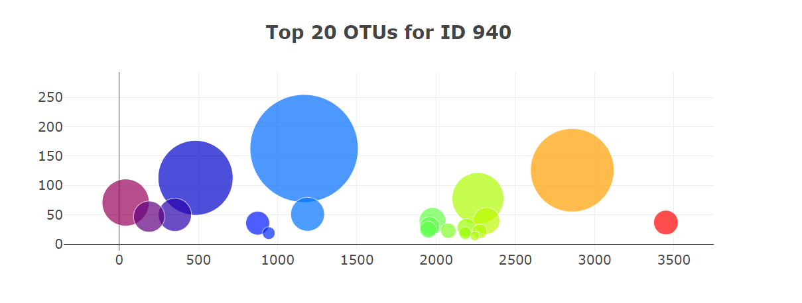

# **belly-button-challenge**
## Module 14 Challenge for UCI Data Analytics Bootcamp

## Vincent Passanisi

## Due January 30, 2023, Submitted February 5, 2023

# **Introduction**
This challenge required the building of an interactive dashboard that would populate a number of graphs illustrating the diversity of microorganisms residing in the belly button of the selected test subject. The test subject is chosen using a dropdown menu of samples in the dataset. Once the subject is chosen, the metadata for that subject is used to populate a panel-box with the demographic information for that subject. There are three graphs on the dashboard, as follows:

* Bar chart of the top ten microbial species, referred to as operational taxonomic units (OTU).
* Scatterplot of the microbial samples collected.
* Indicator gauge that illustrates the washing frequency for the selected test subject.

Final results are hosted on GitHub Pagses: https://vgpass.github.io/belly-button-challenge/

# **Files**

In the repository are the completed challenge files.

* *README.md* - ReadMe file for the project.
* *index.html* is the html file for the challenge.
* *samples.json* is the data file. Note: This file is not used directly since an API call is made to populate the data instead.
* *js* Folder - This folder contains the *app.js* file which is the JavaScript code that updates the html file.
    * This folder also contains a *bonus.js* file. This file is not used, but prevents an error in the html file.
* *output* Folder - This folder contains image files from the html output that are used in this ReadMe.

# **Results**

All charts including the bonus gauge were successfully created (not without much frustration.)

First, the demographic chart populates with the metadata. I selected the sample-metadata id using d3 and created an object with each key and value that are then used to populate the box. I included this code within my chartBuilder function instead of creating a separate function.

I was able to create this chart pretty quickly. It's the one I had the least amount of trouble with, although I had a bit of trouble getting the sorting correct until I remembered to use the slice and reverse functions.

What took me the longest here was trying to get the colors to vary. I wasn't happy with the default colors, and the documentation wasn't clear on how to make it vary. Finally found the colorscale attribute and was able to locate all sorts of options. It was fun playing around with the different color schemes.

I got the basics of the gauge pretty quickly and found some different ways to change the output. I still wasn't able to figure out how to get the ticklabels to show up inside the indicator axis, or how to create the needle indicator. I like the final output, but it isn't exacly like the one in the Canvas instructions. I may play around with this more to see what I can figure out.

Finally, the dashboard was hosted on GitHub Pages

https://vgpass.github.io/belly-button-challenge/

# **Comments and Thoughts**

I really struggled with this challenge, even with a great deal of help from my instructors and tutor. The syntax for JavaScript seems so different from anything we've done before. I understood all the basics and how to manipulate the objects and arrays, but where I really struggled was with how to structure my code. My tutor was awesome and he really helped me understand better how functions worked in JavaScript and how to structure my code. It seemed so simple once he explained it, and I realized it wasn't something we covered in class, so I felt better and less frustrated after my session. He helped me through a few sticking points and I was able to power through the rest of it on my own. This was without a doubt, one of the more challenging homework assignments for me so far.

